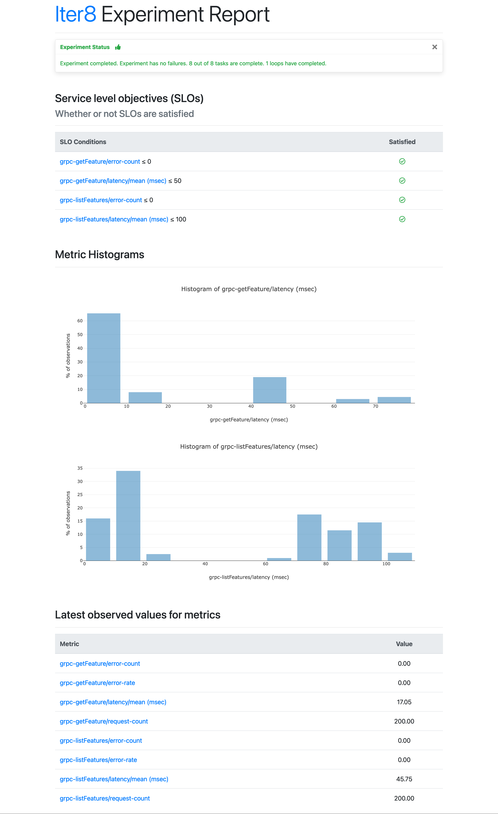

# Iter8: Quick and Easy Automatic Performance Testing

There are many challenges in testing the performance of Kubernetes applications and ML models. For example, there are countless ways to create these apps and models, ranging from a typical Kubernetes deployment to a custom resource like Knative services, KServe inference services, Seldon deployments, or something entirely different. If you are testing an HTTP application, you may have multiple endpoints you would like to test, and similarly for a gRPC application, you may have multiple methods you would like to ensure are working properly. You may also need to have a warm up period before you can begin testing because otherwise, your performance data will not reflect actual usage. Furthermore, you may want to automate the tests so you can get the latest performance data whenever you update your applications. These examples only scratch the surface of the potential problems of assessing the performance of Kubernetes applications and ML models.

Iter8, an open-source Kubernetes release optimizer, was created with these issues in mind and seeks to make performance testing for Kubernetes applications and ML models straightforward and easy. Iter8 can handle previously mentioned concerns and we will show you how. In this article, we will describe how you can configure Iter8 to automatically launch performance testing experiments for an HTTP application and later on, we will also describe how to do the same for a gRPC application.


# Automatic performance testing for multiple HTTP endpoints

### Download Iter8 CLI

```bash
brew tap iter8-tools/iter8
brew install iter8@0.13
```

The Iter8 CLI provides the commands needed to see experiment reports. See [here](https://iter8.tools/0.11/getting-started/install/) for alternate methods of installation.

### Setup Kubernetes cluster with ArgoCD

As mentioned previously, AutoX is built on top of ArgoCD, so we will also need to install it.

A basic install of Argo CD can be done as follows:

```bash
kubectl create namespace argocd
kubectl apply -n argocd -f https://raw.githubusercontent.com/argoproj/argo-cd/stable/manifests/install.yaml
```

See [here](https://argo-cd.readthedocs.io/en/stable/getting_started/#1-install-argo-cd) for more information.

### Deploy HTTP application

Now, we will create an `httpbin` deployment and service. The `httpbin` deployment will later become the trigger object, meaning AutoX will respond to changes to this Kubernetes object.

```bash
kubectl create deployment httpbin --image=kennethreitz/httpbin --port=80
kubectl expose deployment httpbin --port=80
```

### Apply version label

Next, we will assign `httpbin` deployment the `app.kubernetes.io/version` label (version label). AutoX will only launch experiments if the trigger object has a version label. AutoX will relaunch experiments whenever this version label is modified.

```bash
kubectl label deployment httpbin app.kubernetes.io/version=1.0.0
```

### Configure AutoX

Following, we will configure and install the AutoX controller.

```bash
helm install autox autox --repo https://iter8-tools.github.io/hub/ --version 0.1.6 \
--set groups.httpbin.trigger.name=httpbin \
--set groups.httpbin.trigger.namespace=default \
--set groups.httpbin.trigger.group=apps \
--set groups.httpbin.trigger.version=v1 \
--set groups.httpbin.trigger.resource=deployments \
--set groups.httpbin.specs.iter8.name=iter8 \
--set "groups.httpbin.specs.iter8.values.tasks={ready,http,assess}" \
--set groups.httpbin.specs.iter8.values.ready.deploy=httpbin \
--set groups.httpbin.specs.iter8.values.ready.service=httpbin \
--set groups.httpbin.specs.iter8.values.ready.timeout=60s \
--set groups.httpbin.specs.iter8.values.http.numRequests=200 \
--set groups.httpbin.specs.iter8.values.http.endpoints.get.url=http://httpbin.default/get \
--set groups.httpbin.specs.iter8.values.http.endpoints.getAnything.url=http://httpbin.default/anything \
--set groups.httpbin.specs.iter8.values.http.endpoints.post.url=http://httpbin.default/post \
--set groups.httpbin.specs.iter8.values.http.endpoints.post.payloadStr=hello \
--set groups.httpbin.specs.iter8.values.assess.SLOs.upper.http-get/error-count=0 \
--set groups.httpbin.specs.iter8.values.assess.SLOs.upper.http-get/latency-mean=50 \
--set groups.httpbin.specs.iter8.values.assess.SLOs.upper.http-getAnything/error-count=0 \
--set groups.httpbin.specs.iter8.values.assess.SLOs.upper.http-getAnything/latency-mean=75 \
--set groups.httpbin.specs.iter8.values.assess.SLOs.upper.http-post/error-count=0 \
--set groups.httpbin.specs.iter8.values.assess.SLOs.upper.http-post/latency-mean=100 \
--set groups.httpbin.specs.iter8.version=0.13.4 \
--set groups.httpbin.specs.iter8.values.runner=job
```

The AutoX controller configuration is composed of a *trigger object definition* and a set of *experiment specifications*. In this case, the trigger object is the `httpbin` deployment and there is only one experiment, an HTTP performance test with SLO validation associated with this trigger.

To go into more detail, the configuration is composed of a set of *groups*, and each group is composed of a trigger object definition and a set of *experiment specifications*. This enables AutoX to manage one or more trigger objects, each associated with one or more experiments. In this tutorial, there is only one group named `httpbin` (`groups.httpbin...`), and within that group, there is the trigger object definition (`groups.httpbin.trigger...`) and a single experiment spec named `iter8` (`groups.httpbin.specs.iter8...`). 

The trigger object definition is a combination of the name, namespace, and the group-version-resource (GVR) metadata of the trigger object, in this case `httpbin`, `default`, and GVR `apps`, `deployments`, and `v1`, respectively. 

The experiment is an HTTP SLO validation test on the `httpbin` service that is described in greater detail [here](https://iter8.tools/0.13/getting-started/your-first-experiment/). This Iter8 experiment is composed of three tasks, `ready`, `http`, and `assess`. The `ready` task will ensure that the `httpbin` deployment and service are running. The `http` task will generate load for the specified endpoints, `get`, `getAnything`, and `post`, and collect latency and error-related metrics. Lastly, the `assess` task will ensure that the error count is 0 for each endpoint and the mean latency is less than 50, 75, and 100 milliseconds for `get`, `getAnything`, and `post`, respectively. In addition, the runner is set to job as this will be a [single-loop experiment](https://iter8.tools/0.11/getting-started/concepts/#iter8-experiment).

### Observe experiment

After starting AutoX, the HTTP SLO validation test should quickly follow. You can now use the Iter8 CLI in order to check the status and see the results of the test. 

The following command allows you to check the status of the test. Note that you need to specify an experiment group via the `-g` option. The *experiment group* for experiments started by AutoX is in the form `autox-<group name>-<experiment spec name>` so in this case, it would be `autox-httpbin-iter8`.

```bash
iter8 k assert -c completed -c nofailure -c slos -g autox-httpbin-iter8
```

We can see in the sample output that the test has completed, there were no failures, and all SLOs and conditions were satisfied.
```
INFO[2023-01-11 14:43:45] inited Helm config          
INFO[2023-01-11 14:43:45] experiment completed
INFO[2023-01-11 14:43:45] experiment has no failure                    
INFO[2023-01-11 14:43:45] SLOs are satisfied                           
INFO[2023-01-11 14:43:45] all conditions were satisfied  
```

***

The following command allows you to see the results as a text report.

```bash
iter8 k report -g autox-httpbin-iter8
```

<!-- Experiment summary:
*******************

  Experiment completed: true
  No task failures: true
  Total number of tasks: 4
  Number of completed tasks: 4
  Number of completed loops: 1

Whether or not service level objectives (SLOs) are satisfied:
*************************************************************

  SLO Conditions                             | Satisfied
  --------------                             | ---------
  http-get/error-count <= 0                  | true
  http-get/latency-mean (msec) <= 50         | true
  http-getAnything/error-count <= 0          | true
  http-getAnything/latency-mean (msec) <= 75 | true
  http-post/error-count <= 0                 | true
  http-post/latency-mean (msec) <= 100       | true
  

Latest observed values for metrics:
***********************************

  Metric                                 | value
  -------                                | -----
  http-get/error-count                   | 0.00
  http-get/error-rate                    | 0.00
  http-get/latency-max (msec)            | 13.13
  http-get/latency-mean (msec)           | 4.61
  http-get/latency-min (msec)            | 1.15
  http-get/latency-p50 (msec)            | 4.27
  http-get/latency-p75 (msec)            | 6.05
  http-get/latency-p90 (msec)            | 8.17
  http-get/latency-p95 (msec)            | 9.00
  http-get/latency-p99 (msec)            | 11.50
  http-get/latency-p99.9 (msec)          | 12.90
  http-get/latency-stddev (msec)         | 2.36
  http-get/request-count                 | 200.00
  http-getAnything/error-count           | 0.00
  http-getAnything/error-rate            | 0.00
  http-getAnything/latency-max (msec)    | 51.22
  http-getAnything/latency-mean (msec)   | 5.50
  http-getAnything/latency-min (msec)    | 1.21
  http-getAnything/latency-p50 (msec)    | 4.45
  http-getAnything/latency-p75 (msec)    | 6.33
  http-getAnything/latency-p90 (msec)    | 8.40
  http-getAnything/latency-p95 (msec)    | 10.33
  http-getAnything/latency-p99 (msec)    | 45.00
  http-getAnything/latency-p99.9 (msec)  | 50.98
  http-getAnything/latency-stddev (msec) | 5.98
  http-getAnything/request-count         | 200.00
  http-post/error-count                  | 0.00
  http-post/error-rate                   | 0.00
  http-post/latency-max (msec)           | 65.25
  http-post/latency-mean (msec)          | 6.89
  http-post/latency-min (msec)           | 1.20
  http-post/latency-p50 (msec)           | 5.89
  http-post/latency-p75 (msec)           | 8.33
  http-post/latency-p90 (msec)           | 10.67
  http-post/latency-p95 (msec)           | 13.33
  http-post/latency-p99 (msec)           | 20.00
  http-post/latency-p99.9 (msec)         | 64.20
  http-post/latency-stddev (msec)        | 6.46
  http-post/request-count                | 200.00 -->

You can also produce an HTML report that you can view in the browser.

```bash
iter8 k report -g autox-httpbin-iter8 -o html > report.html
```

The HTML report will look similar to the following:


### Continuous and automated experimentation

Now that AutoX is watching the `httpbin` deployment, releasing a new version will relaunch the HTTP SLO validation test. The update must be accompanied by a version label change change; otherwise, AutoX will not do anything.

For simplicity, we will simply change the version label in order to relaunch the HTTP SLO validation test. In the real world, a new version would typically involve a change to the deployment spec (e.g., the container image) and this change should be accompanied by a change to the version label.

```bash
kubectl label deployment httpbin app.kubernetes.io/version=2.0.0 --overwrite
```

### Observe new experiment

Check if a new experiment has been launched. Refer to [Observe experiment](#observe-experiment) for the necessary commands.

If we were to continue to update the deployment (and change its version label), then AutoX would relaunch the experiment for each such change.

### Cleanup

Remove the Iter8 experiment and the sample app from the Kubernetes cluster and the local Iter8 `charts` folder.

```shell
iter8 k delete
kubectl delete svc/httpbin
kubectl delete deploy/httpbin
```

# Automatic performance testing for multiple gRPC endpoints

Now that we have described how you can automatically conduct performance tests for HTTP endpoints, we will do the same for gRPC endpoints.

[Download Iter8 CLI](#download-iter8-cli) and [Setup Kubernetes cluster with ArgoCD](#setup-kubernetes-cluster-with-argocd) if you have not done so already.

### Deploy gRPC application

We will create a `routeguide` deployment and service, similar to the `httpbin` deployment and service in the HTTP tutorial. The `routeguide` deployment will later become the trigger object, meaning AutoX will respond to changes to this Kubernetes object.

```bash
kubectl create deployment routeguide --image=golang --port=50051 \
-- bash -c "git clone -b v0.13.13 --depth 1 https://github.com/iter8-tools/docs; cd docs/samples/route_guide; go run server/server.go"
kubectl expose deployment routeguide --port=50051
```

### Apply version label

Next, we will assign `routeguide` deployment the `app.kubernetes.io/version` label (version label). As mentioned in the HTTP tutorial, AutoX will relaunch experiments whenever this version label is modified.

```bash
kubectl label deployment routeguide app.kubernetes.io/version=1.0.0
```

### Configure AutoX

Following, we will configure and install the AutoX controller.

```bash
helm install autox autox --repo https://iter8-tools.github.io/hub/ --version 0.1.6 \
--set groups.routeguide.trigger.name=routeguide \
--set groups.routeguide.trigger.namespace=default \
--set groups.routeguide.trigger.group=apps \
--set groups.routeguide.trigger.version=v1 \
--set groups.routeguide.trigger.resource=deployments \
--set groups.routeguide.specs.iter8.name=iter8 \
--set "groups.routeguide.specs.iter8.values.tasks={ready,grpc,assess}" \
--set groups.routeguide.specs.iter8.values.ready.deploy=routeguide \
--set groups.routeguide.specs.iter8.values.ready.service=routeguide \
--set groups.routeguide.specs.iter8.values.ready.timeout=60s \
--set groups.routeguide.specs.iter8.values.grpc.host=routeguide.default:50051 \
--set groups.routeguide.specs.iter8.values.grpc.endpoints.getFeature.call=routeguide.RouteGuide.GetFeature \
--set groups.routeguide.specs.iter8.values.grpc.endpoints.getFeature.dataURL=https://raw.githubusercontent.com/iter8-tools/docs/v0.13.13/samples/grpc-payload/unary.json \
--set groups.routeguide.specs.iter8.values.grpc.endpoints.listFeatures.call=routeguide.RouteGuide.ListFeatures \
--set groups.routeguide.specs.iter8.values.grpc.endpoints.listFeatures.dataURL=https://raw.githubusercontent.com/iter8-tools/docs/v0.13.13/samples/grpc-payload/server.json \
--set groups.routeguide.specs.iter8.values.grpc.protoURL=https://raw.githubusercontent.com/iter8-tools/docs/v0.13.13/samples/route_guide/routeguide/route_guide.proto \
--set groups.routeguide.specs.iter8.values.assess.SLOs.upper.grpc-getFeature/error-count=0 \
--set groups.routeguide.specs.iter8.values.assess.SLOs.upper.grpc-getFeature/latency/mean=50 \
--set groups.routeguide.specs.iter8.values.assess.SLOs.upper.grpc-listFeatures/error-count=0 \
--set groups.routeguide.specs.iter8.values.assess.SLOs.upper.grpc-listFeatures/latency/mean=100 \
--set groups.routeguide.specs.iter8.version=0.13.4 \
--set groups.routeguide.specs.iter8.values.runner=job
```

The biggest difference between this configuration and the configuration from the HTTP tutorial is the `grpc` task, which has replaced the `http` task. In this example, we specify one group name `routeguide` (`groups.routeguide`)

In this tutorial, there is only one group named `routeguide` (`groups.routeguide`), and within that group, there is the trigger object definition (`groups.routeguide.trigger...`) and a single experiment spec named `iter8` (`groups.routeguide.specs.iter8...`). 

The trigger object definition is a combination of the name, namespace, and the group-version-resource (GVR) metadata of the trigger object, in this case `routeguide`, `default`, and GVR `apps`, `deployments`, and `v1`, respectively.

The experiment is a gRPC SLO validation test on the `routeguide` service that is described in greater detail [here](https://iter8.tools/0.13/tutorials/load-test-grpc/). This Iter8 experiment is composed of three tasks, `ready`, `grpc`, and `assess`. The `ready` task will ensure that the `routeguide` deployment and service are running. The `grpc` task will generate load for the specified endpoints, `getFeature` and `listFeatures`, and collect latency and error-related metrics. Lastly, the `assess` task will ensure that the error count is 0 for both endpoints and the mean latency is less than 50 and 100 milliseconds for `getFeature` and `listFeatures`, respectively. In addition, the runner is set to job as this will be a [single-loop experiment](https://iter8.tools/0.11/getting-started/concepts/#iter8-experiment).

### Observe experiment

After starting AutoX, the gRPC SLO validation test should quickly follow. The *experiment group* for this experiment is `autox-routeguide-iter8`.

```bash
iter8 k assert -c completed -c nofailure -c slos -g autox-routeguide-iter8
```

We can see in the sample output that the test has completed, there were no failures, and all SLOs and conditions were satisfied.
```
INFO[2023-01-11 14:43:45] inited Helm config          
INFO[2023-01-11 14:43:45] experiment completed
INFO[2023-01-11 14:43:45] experiment has no failure                    
INFO[2023-01-11 14:43:45] SLOs are satisfied                           
INFO[2023-01-11 14:43:45] all conditions were satisfied  
```

***

The following command allows you to see the results as a text report.

```bash
iter8 k report -g autox-routeguide-iter8
```

<!-- Experiment summary:
*******************

  Experiment completed: true
  No task failures: true
  Total number of tasks: 7
  Number of completed tasks: 7
  Number of completed loops: 1

Whether or not service level objectives (SLOs) are satisfied:
*************************************************************

  SLO Conditions                               | Satisfied
  --------------                               | ---------
  grpc-getFeature/error-count <= 0             | true
  grpc-getFeature/latency/mean (msec) <= 50    | true
  grpc-listFeatures/error-count <= 0           | true
  grpc-listFeatures/latency/mean (msec) <= 100 | true
  

Latest observed values for metrics:
***********************************

  Metric                                | value
  -------                               | -----
  grpc-getFeature/error-count           | 0.00
  grpc-getFeature/error-rate            | 0.00
  grpc-getFeature/latency/mean (msec)   | 5.56
  grpc-getFeature/request-count         | 200.00
  grpc-listFeatures/error-count         | 0.00
  grpc-listFeatures/error-rate          | 0.00
  grpc-listFeatures/latency/mean (msec) | 7.07
  grpc-listFeatures/request-count       | 200.00 -->

You can also produce an HTML report that you can view in the browser.

```bash
iter8 k report -g autox-routeguide-iter8 -o html > report.html
```

The HTML report will look similar to the following:


### Continuous and automated experimentation

Now that AutoX is watching the `routeguide` deployment, releasing a new version will relaunch the gRPC SLO validation test. The update must be accompanied by a version label change change; otherwise, AutoX will not do anything.

Again, we will simply change the version label in order to relaunch the test but in the real world, a new version would typically involve a change to the deployment spec (e.g., the container image) as well.

```bash
kubectl label deployment routeguide app.kubernetes.io/version=2.0.0 --overwrite
```

### Observe new experiment

Check if a new experiment has been launched. Refer to [Observe experiment](#observe-experiment) for the necessary commands.

If we were to continue to update the deployment (and change its version label), then AutoX would relaunch the experiment for each such change.

### Cleanup

Remove the Iter8 experiment and the sample app from the Kubernetes cluster and the local Iter8 `charts` folder.

```shell
iter8 k delete
kubectl delete svc/routeguide
kubectl delete deploy/routeguide
```

### More things you can do

In this article, we show how you can automate performance testing for both HTTP and gRPC. The first thing you should consider is trying it out on your own HTTP and gRPC clusters. In order to do this, recall that you need to specify a trigger object, ensure the trigger object has a version label, and configure Iter8 with the appropriate performance tests to run.

In the tutorials, we utilized the `http` and `grpc` tasks. Both of these tasks can be augmented in a number of ways, such as adding headers, providing a payload, or modulating the query rate. To learn more, see [here](https://iter8.tools/0.13/user-guide/tasks/http/) for the documentation of the `http` task and [here](https://iter8.tools/0.13/user-guide/tasks/grpc/) for the documentation of the `grpc` task.

AutoX is designed to use any Kubernetes resource object (including those with a custom resource type) as a trigger object in AutoX. For example, the trigger object can be a Knative service, a KServe inference service, or a Seldon deployment.

Furthermore, you can add additional tasks that ship out-of-the-box with Iter8, in order to enrich the experiments. For example, you can add a `slack` task so that your experiment results will be posted on Slack. That way, you can automatically have the lastest performance statistics after every update. Here is the [documentation](https://iter8.tools/0.13/user-guide/tasks/slack/) for the `slack` task as well as a [tutorial](https://iter8.tools/0.13/tutorials/integrations/slack/) for using the Slack task.

You can also automate experiments that are not from Iter8. For example, a [Litmus Chaos chaos experiment](https://github.com/iter8-tools/hub/tree/8e40c740a33afba4afd5623588128da49b7f08f1/charts/litmuschaos) is available on Iter8 hub, which can also be configured with AutoX.

Lastly, recall that you can provide multiple groups and experiment specs so AutoX can launch and manage a whole suite of experiments for multiple Kubernetes applications and namespaces.

### Takeaways

Iter8 is a powerful performance testing tool for your Kubernetes applications, and now you can configure Iter8 in a delarative manner so that you can it automatically test your applications as soon as you update them. Configuring AutoX is straightforward, and just requires specifying a trigger Kubernetes resource object and the experiments you want to associated with this trigger object. Please see the [Iter8 documentation](https://iter8.tools) for more information all the other things you can do with Iter8! You can engage with the Iter8 community on [Slack](https://join.slack.com/t/iter8-tools/shared_invite/zt-awl2se8i-L0pZCpuHntpPejxzLicbmw) and [GitHub](https://github.com/iter8-tools/iter8).